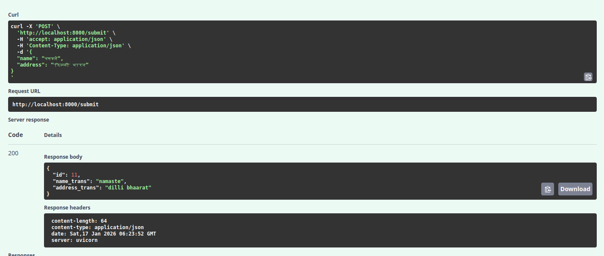
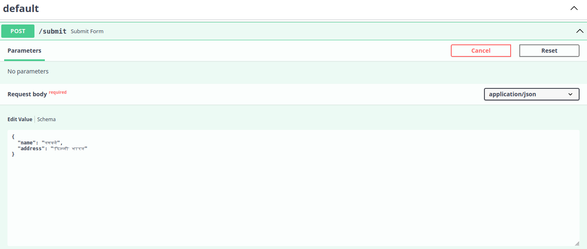

# Fast-Translit Backend




This project is a **FastAPI-based backend service** that accepts user input (name and address), transliterates the text using **AI4Bharat’s Indic Transliteration Engine**, and stores the processed data in a **PostgreSQL database** using **SQLAlchemy ORM**.

The system is designed to be simple, deterministic, and production-aligned, with a clear separation of concerns between API, database, business logic, and AI processing.

---

## High-Level Flow

1. Client sends a `POST` request to the API with `name` and `address`
2. Backend receives the request via FastAPI
3. Text is passed to the AI4Bharat transliteration engine
4. Transliteration output is generated
5. Transliterated data is persisted in PostgreSQL
6. Saved record is returned as API response

---

## Project Structure

```
Fast-Translit/
├── Backend/
│   ├── main.py          # FastAPI app entry point
│   ├── db.py            # Database engine & session management
│   ├── models.py        # SQLAlchemy ORM models
│   ├── schemas.py       # Pydantic request/response schemas
│   ├── crud_helper.py   # Database CRUD + transliteration logic
│   ├── translit.py      # AI4Bharat transliteration wrapper
│   ├── create_db.py     # One-time DB table creation
│   ├── rabbitmq.py      # (Optional) async messaging support
│   └── __init__.py
├── requirements.txt
├── README.md
└── .env                 # Environment variables (not committed)
```

---

## Transliteration Logic

* The project uses **AI4Bharat XlitEngine**
* All input text is transliterated (no script detection checks)
* Hindi (`hi`) is used as the language code
* Beam search is enabled for better transliteration quality




Example:

```
नमस्ते → namaste
दिल्ली भारत → dilli bhaarat
```

---

## Technology Stack

* **Backend Framework**: FastAPI
* **Database**: PostgreSQL
* **ORM**: SQLAlchemy
* **AI Transliteration**: AI4Bharat Indic Transliteration
* **ASGI Server**: Uvicorn
* **Python Version**: 3.10 (strictly recommended)

---

## Version Requirements (IMPORTANT)

To avoid runtime issues, **use the exact versions below**.

### Python

```
Python 3.10.x
```

> AI4Bharat transliteration is **not stable on Python 3.12** and may fail silently.

---

## Environment Variables (`.env`)

Create a `.env` file in the project root:

```
DATABASE_URL=postgresql://postgres:<password>@localhost:5432/user_data
```

Ensure PostgreSQL is running and the database exists.

---

## Database Setup

Create the database manually:

```sql
CREATE DATABASE user_data;
```

Create tables:

```bash
python Backend/create_db.py
```

---

## Running the Application

Activate virtual environment:

```bash
source venv/bin/activate
```

Start the server:

```bash
uvicorn Backend.main:app --reload
```

API will be available at:

```
http://127.0.0.1:8000
```

Swagger UI:

```
http://127.0.0.1:8000/docs
```

---

## Example API Request

### POST `/submit`

**Request Body**

```json
{
  "name": "नमस्ते",
  "address": "दिल्ली भारत"
}
```

**Response**

```json
{
  "id": 9,
  "name_trans": "namaste",
  "address_trans": "dilli bhaarat"
}
```

---

## Database Inspection (psql)

```sql
\c user_data
SELECT * FROM user_submissions;
```

---

## Notes & Constraints

* Transliteration quality depends on AI4Bharat model output
* Mixed-script input may produce partial transliteration
* This backend assumes **single-language Hindi transliteration**
* RabbitMQ integration is optional and currently unused

---

## Future Enhancements

* Language auto-detection
* Async transliteration via message queue
* Batch submission support
* REST pagination & filtering
* Admin dashboard

---

## Maintainer Notes

If you face:

* Incorrect transliteration → verify `torch` and Python version
* DB connection issues → verify `.env` and PostgreSQL service
* Silent failures → run with `--log-level debug`
# Transliteration
